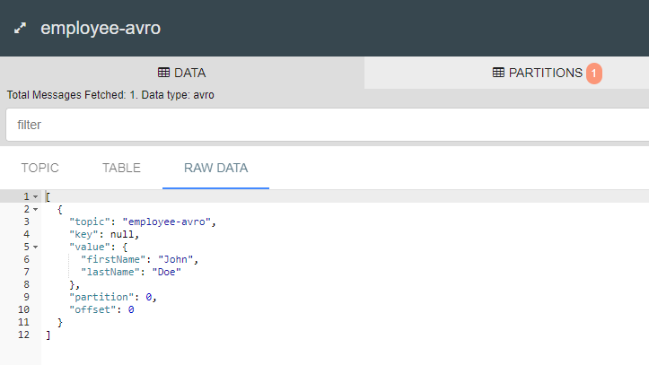

# Events Demo Producer

Spring Boot Application with Kafka Integration, Apache Avro Schema and RESTful API.

## First words

### Local environment

* Start Zookeeper, Kafka Broker, JMX Ports, REST Proxy, Schema Registry and Kafka Connect

```sh
docker-compose up -d
```

## Build and Run

```sh
mvn spring-boot:run
```

## Testing

* Sending Employee's fake creation message

```http
POST http://localhost:8080/employee
Content-Type: application/json

{
  "firstName": "John",
  "lastName": "Doe"
}
```

* View raw data on Landoop UI

<center>
    
</center>